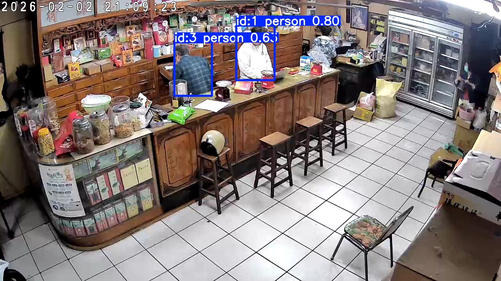

# 🎯 智慧店鋪監控系統 | Smart Shop Surveillance System

<p align="center">
  
  
  
  
  
</p>

<p align="center">
  <b>基於 Ultralytics YOLO 的即時人流偵測與追蹤系統，整合 WebRTC 低延遲串流、LINE 即時通知、智慧訪客統計</b>
</p>

---

## 📸 系統預覽

<table>
  <tr>
    <td width="50%">
      
      <p align="center"><em>即時監控 + YOLO 偵測</em></p>
    </td>
    <td width="50%">
      
      <p align="center"><em>訪客統計儀表板</em></p>
    </td>
  </tr>
  <tr>
    <td width="50%">
      <!-- TODO: 補上 LINE 通知截圖 (assets/photos/line-notify.jpg) -->
      <p align="center"><code>📱 LINE 通知截圖待補充</code></p>
      <p align="center"><em>LINE 即時推播通知</em></p>
    </td>
    <td width="50%">
      
      <p align="center"><em>ROI 區域互動設定工具</em></p>
    </td>
  </tr>
</table>

---

## ✨ 功能特色

| 功能 | 描述 |
|------|------|
| 🎯 **即時人員偵測** | 支援 YOLO11/YOLO26 模型，多種尺寸可選 (n/s/m/l)，依硬體效能調整 |
| 🔄 **多目標追蹤** | ByteTrack 演算法，穩定追蹤每位訪客的移動軌跡 |
| 📍 **ROI 區域判定** | 自訂多邊形區域，精準判定「門口進入 → 店內」的訪客動線 |
| 📊 **智慧統計分析** | 每小時/每日客流量、尖峰時段分析、歷史趨勢圖表 |
| 📱 **LINE 即時通知** | 訪客進店即時推播，附帶截圖，支援多用戶訂閱 |
| 🎥 **WebRTC 串流** | 超低延遲 (<500ms) 即時影像，支援遠端監控 |
| 💾 **事件錄影** | 自動錄製並上傳至 Cloudflare R2，支援 HLS 回放 |
| 🔔 **音效警報** | TTS 語音播報 + 自訂提示音 |

---

## 🏗️ 系統架構

```
┌─────────────────────────────────────────────────────────────────┐
│                        RTSP Camera Input                        │
└─────────────────────────────────────────────────────────────────┘
                                  │
                                  ▼
┌─────────────────────────────────────────────────────────────────┐
│                    Detection & Tracking Layer                   │
│  ┌─────────────────┐    ┌─────────────────┐    ┌─────────────┐  │
│  │  YOLO (v11/v26) │ -> │   ByteTrack     │ -> │  ROI Check  │  │
│  │   (Inference)   │    │   (Tracking)    │    │  (Entry)    │  │
│  └─────────────────┘    └─────────────────┘    └─────────────┘  │
└─────────────────────────────────────────────────────────────────┘
                                  │
                    ┌─────────────┼─────────────┐
                    ▼             ▼             ▼
        ┌───────────────┐ ┌─────────────┐ ┌───────────────┐
        │  State Layer  │ │ Notify Layer│ │ Stream Layer  │
        │ ┌───────────┐ │ │ ┌─────────┐ │ │ ┌───────────┐ │
        │ │  SQLite   │ │ │ │  LINE   │ │ │ │  WebRTC   │ │
        │ │  Storage  │ │ │ │  Push   │ │ │ │  Gateway  │ │
        │ └───────────┘ │ │ ├─────────┤ │ │ └───────────┘ │
        │ ┌───────────┐ │ │ │  Audio  │ │ │ ┌───────────┐ │
        │ │   Shop    │ │ │ │  Alert  │ │ │ │   Video   │ │
        │ │  Manager  │ │ │ ├─────────┤ │ │ │  Recorder │ │
        │ └───────────┘ │ │ │   R2    │ │ │ └───────────┘ │
        └───────────────┘ │ │  Upload │ │ └───────────────┘
                          │ └─────────┘ │
                          └─────────────┘
                                  │
                                  ▼
┌─────────────────────────────────────────────────────────────────┐
│                         FastAPI Server                          │
│         REST API  +  WebSocket Signaling  +  Static Files       │
└─────────────────────────────────────────────────────────────────┘
                                  │
                                  ▼
┌─────────────────────────────────────────────────────────────────┐
│                     Cloudflare Tunnel (HTTPS)                   │
└─────────────────────────────────────────────────────────────────┘
```

---

## 🔧 技術實現重點

### 1. YOLO 即時推論引擎

```python
# 核心推論迴圈 - 每秒處理 15-30 幀
def _loop(self):
    while self.running:
        frame = self.rtsp_reader.read()
        # 支援 YOLO11 / YOLO26 等多種模型版本
        results = self.model.track(frame, persist=True, tracker="bytetrack.yaml")

        for box in results[0].boxes:
            track_id = box.id
            center = self._get_center(box)

            # ROI 區域判定：門口 → 店內 = 有效進店
            if self._in_entry_zone(center) and self._was_in_inside_zone(track_id):
                self.on_visitor_enter(track_id, frame)
```

**技術亮點：**
- 使用 Ultralytics YOLO，支援 v11/v26 等版本靈活切換
- 支援 ONNX/TensorRT 加速推論
- ByteTrack 多目標追蹤，解決遮擋與 ID 跳變問題
- 自適應幀率控制，平衡效能與準確度

### 2. WebRTC 低延遲串流

```python
# RTSP → WebRTC 轉換
class RTSPVideoTrack(MediaStreamTrack):
    async def recv(self):
        frame = await self.rtsp_reader.read_async()
        return VideoFrame.from_ndarray(frame, format="bgr24")
```

**技術亮點：**
- aiortc 實現純 Python WebRTC
- STUN/TURN 穿透 NAT，支援 4G/5G 網路
- 動態碼率調整，適應不同網路環境

### 3. 執行緒安全的狀態管理

```python
class ShopStateManager:
    def __init__(self):
        self._lock = threading.Lock()
        self._state = ShopState()

    def record_entry(self, track_id: int):
        with self._lock:
            self._state.today_visitors += 1
            self._state.current_inside += 1
            self._db.record_entry(track_id)  # 同步寫入 SQLite
```

**技術亮點：**
- Thread-safe 設計，避免競態條件
- 跨日自動重置計數器
- SQLite 持久化 + 記憶體快取雙層架構

### 4. 非同步事件處理

```python
class EventWorker:
    def __init__(self):
        self._queue = queue.Queue(maxsize=10)
        self._thread = threading.Thread(target=self._worker)

    def _worker(self):
        while True:
            event = self._queue.get()
            # 非阻塞處理：LINE 推播、R2 上傳、音效播放
            asyncio.run(self._process(event))
```

**技術亮點：**
- 生產者-消費者模式，主執行緒不阻塞
- 可配置佇列大小與溢滿策略
- 失敗重試機制

---

## 🛠️ 技術棧

| 類別 | 技術 |
|------|------|
| **深度學習** | PyTorch, Ultralytics YOLO (v11/v26), ByteTrack |
| **後端框架** | FastAPI, Uvicorn, Pydantic |
| **即時通訊** | aiortc (WebRTC), WebSocket |
| **資料庫** | SQLite3 |
| **影像處理** | OpenCV, FFmpeg, PyAV |
| **雲端服務** | Cloudflare R2/Workers/Tunnel, LINE Messaging API |
| **前端** | Vanilla JS, Chart.js, WebRTC API |
| **部署** | NSSM (Windows Service), Cloudflare Tunnel |

---

## 📦 專案結構

```
smart-shop-surveillance/
├── server.py                 # FastAPI 應用程式入口
├── modules/
│   ├── core/
│   │   ├── yolo_runtime.py      # 🎯 YOLO 推論 + 追蹤核心 (506 行)
│   │   ├── shop_state_manager.py # 📊 訪客狀態管理
│   │   └── event_worker.py       # ⚡ 非同步事件處理
│   ├── storage/
│   │   ├── visitor_db.py         # 💾 SQLite 資料持久化
│   │   └── cloudflare_r2.py      # ☁️ R2 物件儲存
│   ├── notifications/
│   │   ├── line_notify.py        # 📱 LINE 推播通知
│   │   └── audio_alert.py        # 🔔 音效警報
│   ├── video/
│   │   ├── rtsp_reader.py        # 📹 RTSP 串流讀取
│   │   ├── video_recorder.py     # 🎬 事件錄影
│   │   └── recording_worker.py   # 📼 背景錄製
│   └── webrtc/
│       ├── gateway.py            # 🌐 WebRTC 連線管理
│       └── rtsp_video_track.py   # 🔄 RTSP→WebRTC 轉換
├── routers/                  # API 路由層
├── web/                      # 前端靜態檔案
├── config/                   # 設定檔 (YAML/JSON)
├── scripts/                  # 工具腳本
└── docs/                     # 技術文件
```

---

## 🚀 快速開始

### 環境需求

- Python 3.10+
- FFmpeg
- 支援 RTSP 的網路攝影機

### 安裝

```bash
# Clone 專案
git clone https://github.com/yourusername/smart-shop-surveillance.git
cd smart-shop-surveillance

# 建立虛擬環境
python -m venv venv
source venv/bin/activate  # Windows: venv\Scripts\activate

# 安裝依賴
pip install -r requirements.txt
```

### 設定環境變數

```bash
cp .env.example .env
# 編輯 .env 填入你的設定
```

### 啟動服務

```bash
# 開發模式
uvicorn server:app --reload

# 正式環境
uvicorn server:app --host 0.0.0.0 --port 8000
```

### Windows 服務部署

```powershell
# 安裝 NSSM
winget install nssm

# 執行安裝腳本
.\scripts\install_services.ps1 -ProjectPath "D:\your\path" -LogPath "D:\logs"
```

詳見 [Windows 服務部署指南](docs/windows_service_setup.md)

---

## 📊 API 端點

| 方法 | 路徑 | 說明 |
|------|------|------|
| GET | `/watch` | 即時監控頁面 |
| GET | `/dashboard` | 統計儀表板 |
| GET | `/api/dashboard/realtime` | 即時統計數據 |
| POST | `/api/dashboard/hourly` | 每小時統計 |
| GET | `/api/dashboard/daily` | 每日統計 |
| GET | `/api/dashboard/summary` | 摘要統計 |
| GET | `/shop-state` | 店鋪即時狀態 |
| WS | `/ws` | WebRTC 信令 |

---

## 📈 效能指標

| 指標 | 數值 |
|------|------|
| 推論延遲 | ~30ms (YOLO26m, RTX 3060) |
| 串流延遲 | <500ms (WebRTC) |
| 追蹤準確度 | >95% (ByteTrack) |
| 記憶體使用 | ~800MB |
| 支援解析度 | 最高 4K (2304×1296 測試通過) |

---

## 🔮 未來規劃

- [ ] Docker 容器化部署
- [ ] 多攝影機聯合追蹤
- [ ] 熱力圖分析
- [ ] 顧客停留時間統計
- [ ] Prometheus 監控指標

---

## 📄 授權

MIT License - 詳見 [LICENSE](LICENSE)

---

<p align="center">
  <sub>Built with ❤️ using Python, YOLO, and modern web technologies</sub>
</p>
